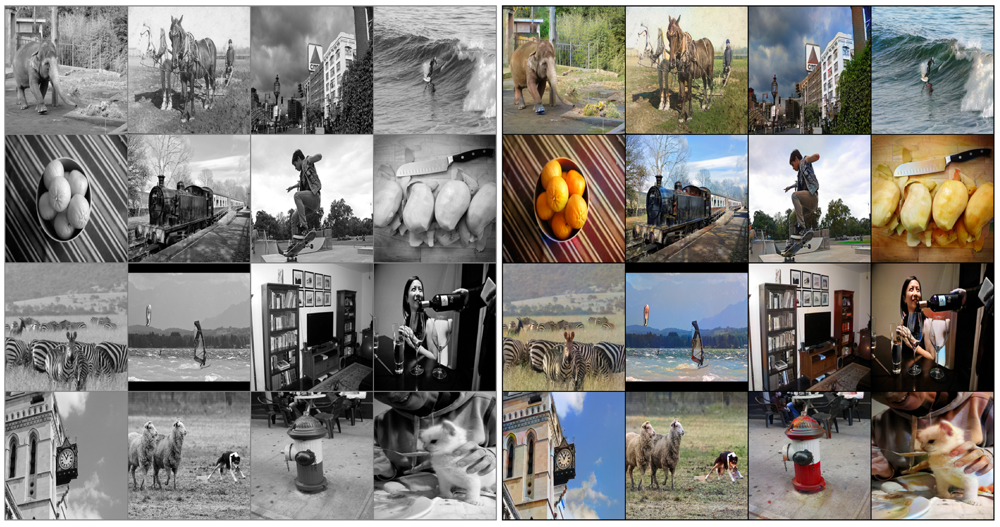
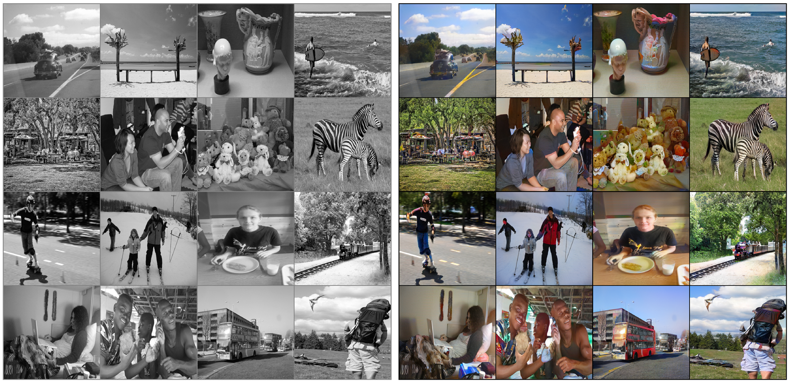

# Image Colorization with U-Net and GAN Tutorial

**This is an advanced tutorial on _Image Colorization_ using deep learning and [PyTorch](https://pytorch.org/).**

**This is [the related article](https:/) on TowardsDataScince by myself which you can check out. I've put the explanations here as well but one could prefer to read it from the article.**

I highly recommend that you go through this tutorial via the related **Jupyter notebook in this repository** in which you can freely play with the code. All the explanations are included there as well.

## Final model's output 

Left: Input black & white images from test set | Right: the colorized outputs by the final model of this tutorial

---

Left: Input black & white images from test set | Right: the colorized outputs by the final model of this tutorial

---

Left: Input black & white images from test set | Right: the colorized outputs by the final model of this tutorial

---

One of the most exciting applications of deep learning is colorizing black and white images.  This task needed a lot of human input and hardcoding several years ago but now the whole process can be done end-to-end with the power of AI and deep learning. You might think that you need huge amount of data or long training times to train your model from scratch for this task but in the last few weeks I worked on this and tried many different model architectures, loss functions, training strategies, etc. and finally developed an efficient strategy to train such a model, using the latest advances in deep learning, on a rather small dataset and with really short training times. In this article, I'm going to explain what I did, including the code!,  to make this happen and the strategies that helped and also those that were not useful. Before that, I will explain the colorization problem and a give you a short review of what has been done in recent years. I'll assume you have basic knowledge about deep learning, GANs, and PyTorch library for the rest of the article. Let's begin!
